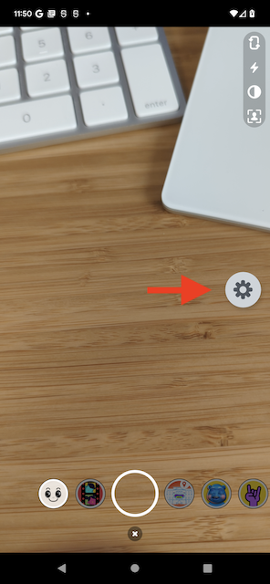
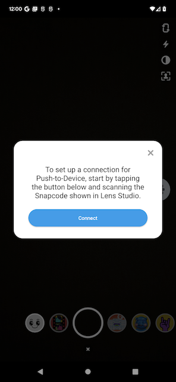
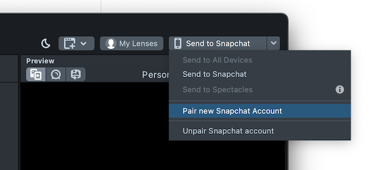
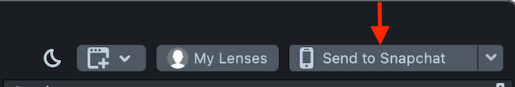

# Push-to-Device (P2D)

Applications can receive lenses from Lens Studio via the `camerakit-extension-lens-push-to-device` integration. This makes it easy for you to test lenses before publishing them.

## Integration

To integrate P2D:

1. Add the P2D extension dependency to your build configuration. Note that this feature should not be shipped to end-users, as it is meant for lens development.

    ```groovy
    debugImplementation "com.snap.camerakit:camerakit-extension-lens-push-to-device:$cameraKitVersion"
    ```

2. Follow [Login Kit Integration](#Login-Kit-Integration) section below. Login Kit is used for authentication so that Lens Studio and your device can be paired together.
    - Add the `https://auth.snapchat.com/oauth2/api/camkit_lens_push_to_device` scope to the Login Kit scope configuration.
    - Note: Make sure to use the `staging` oAuth2 clientId, since P2D is not meant to work for `production`.
    - Note: In order to log in with accounts while using the `staging` oAuth2 clientId, your account needs to be added to the `Demo Users` list on `kit.snapchat.com/manage/apps/<your-app-id>`.

   

3. Configure the P2D extension using either the `scoped` or `unscoped` API.
    - Use the `scoped` API if you have the `LensesComponent.Builder` context:

        ```kotlin
        configureLenses {
            configurePushToDevice {
                authTokenProvider(loginKitAuthTokenProvider)
            }
        }
        ```
    - Use the `unscoped` API if you do not have the `LensesComponent.Builder` context:

        ```kotlin
        val globalConfigurationCloseable = LensPushToDeviceService.configure {
            authTokenProvider(loginKitAuthTokenProvider)
        }
        ```

4. Subscribe for the P2D lens groupId:

    ```kotlin
    private val LENS_GROUPS = arrayOf(
        LensPushToDeviceService.LENS_GROUP_ID
    )
    ```

## P2D Workflow

1. Once P2D and Login Kit are integrated, you should see a new movable floating icon in your app:

   

2. Tap the icon to bring up the P2D menu, which can be used to start the pairing process:

   

3. Scan the Snapcode presented by Lens Studio:

   

4. Enter the Snap credentials, and then pairing should succeed. P2D floating icon should turn green to indicate success.

5. When you are ready to test your lens, kick off the push flow from Lens Studio:

   

## Login Kit Integration

To integrate Login Kit, which is a dependency for Camera Kit extensions like P2D:

1. Add the following build dependency: `debugImplementation "com.snap.camerakit:camerakit-extension-auth-token-provider-loginkit:$cameraKitVersion"`
2. Add the following array where scopes are requested. The below example includes the scope required for P2D.

    ```xml
    <array name="snap_kit_scopes">
        <item>https://auth.snapchat.com/oauth2/api/camkit_lens_push_to_device</item>
    </array>
    ```

3. Define `loginKitClientId`, `loginKitRedirectUrl`, `loginKitScheme`, `loginKitHost`, and `loginKitPath` in your application's `manifestPlaceholders`. The information for these fields can be retrieved and/or configured from the [Snap Kit portal](https://kit.snapchat.com/).

    ```groovy
    manifestPlaceholders = [
        ...
        loginKitClientId        : <fill_in>,
        loginKitRedirectUrl     : <fill_in>,
        loginKitScheme          : <fill_in>,
        loginKitHost            : <fill_in>,
        loginKitPath            : <fill_in>,
    ]
   ```

4. Update your application's `AndroidManifest.xml`, with the two steps below. This will allow your application to properly receive auth results.
    1. Add the following metadata:
       ```xml
       <meta-data
           android:name="com.snap.kit.clientId"
           android:value="${loginKitClientId}"
           />
       <meta-data
           android:name="com.snap.kit.redirectUrl"
           android:value="${loginKitRedirectUrl}"
           />
       <meta-data
           android:name="com.snap.kit.scopes"
           android:resource="@array/snap_kit_scopes"
           />
       ```
    2. Add this activity:
       ```xml
       <activity
         android:name="com.snap.corekit.SnapKitActivity"
         android:launchMode="singleTask"
         android:exported="true"
         >
   
         <intent-filter>
             <action android:name="android.intent.action.VIEW" />
   
             <category android:name="android.intent.category.DEFAULT" />
             <category android:name="android.intent.category.BROWSABLE" />
   
             <data
                 android:scheme="${loginKitScheme}"
                 android:host="${loginKitHost}"
                 android:path="${loginKitPath}"
                 />
         </intent-filter>
       </activity>
       ```

5. Now you can use it as such: `val loginKitAuthTokenProvider = LoginKitAuthTokenProvider(applicationContext)`

## Troubleshooting

### I tapped Connect, but nothing happens
- After tapping Connect, you should see the icon change to a purple scanning icon. Make sure to point your camera at Lens Studio's Snapcode to scan it.

### Failure when attempting to log in
- Make sure your device has internet connectivity.
- Make sure you are using the `staging` oAuth2 client ID, and not the `production` version. P2D only works on the former.
- Make sure you have added your username to the `Demo Users` list on `kit.snapchat.com/manage/apps/<your-app-id>`.

### I entered my Snap credentials but when it goes back to my app, the icon turns grey (and not green)
- Make sure you have followed the [Login Kit Integration](#Login-Kit-Integration) section entirely. 

### I tried to push a lens, but nothing is received on my device
- Make sure that your device has internet connectivity.
- Ensure that you have paired successfully. The P2D icon should be a green gear icon.
- If pairing is successful, tap on the gear icon to see if any error occurred. This may happen sometimes, for example when Lens Studio and your Camera Kit application versions are [incompatible](https://docs.snap.com/camera-kit/ar-content/lens-studio-compatibility#camera-kit-version-parity).
- If the push succeeded (e.g. system notification) but the lens is not showing up in your carousel, ensure that your application is subscribed to `LensPushToDeviceService.LENS_GROUP_ID`

### I don't see the P2D icon
- Currently P2D is only supported if your application uses the built-in lenses carousel.

### How do I log out and use another Snap account for P2D?
- Clear your app's storage. Then:
    - If auth was via web browser, clear its cookies. If you have multiple browsers installed, make sure to clear the correct one.
    - If auth was via the Snapchat app, log out of the original account and log in to the new account that you want to use.
