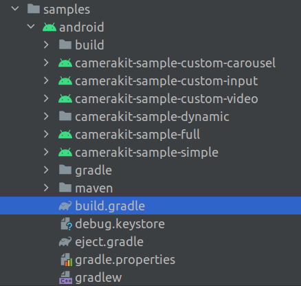

# Camera Kit Android

Demonstrates uses of the Camera Kit SDK on the Android platform.

Table of contents
=================

<!--ts-->
   * [Getting Started](#getting-started)
      * [Requirements](#requirements)
      * [IDE](#ide)
      * [Samples](#samples)
      * [Configuration](#configuration)
   * [Usage](#usage)
      * [Lifecycle](#lifecycle)
      * [Java or Kotlin?](#java-or-kotlin)
      * [Proguard](#proguard)
   * [Development](#development)
      * [Push to Device](#push-to-device-p2d)
      * [Profiling](#profiling)
   * [Troubleshooting](#troubleshooting)
<!--te-->

## Getting Started

### Requirements

- Recent Android Studio (2021+), download latest at: https://developer.android.com/studio.
- Android 5.0 device or emulator, with a minimum SDK API level of 21, is required.
- Java 11 SDK, recommended installer: https://sdkman.io/.

### IDE

Open the samples project in Android Studio by opening the root [`build.gradle`](./build.gradle) file:



### Samples

This project includes several sample apps that demonstrate different approaches to integrating the Camera Kit SDK:

- [`camerakit-sample-full`](./camerakit-sample-full) contains a fully functioning camera capture with lenses and preview flow.
- [`camerakit-sample-custom-video`](./camerakit-sample-custom-video) demonstrates how to set up a custom video/audio encoding and audio source implementation.
- [`camerakit-sample-custom-input`](./camerakit-sample-custom-input) demonstrates how to setup a custom input to the Camera Kit's processing pipeline.
- [`camerakit-sample-simple`](./camerakit-sample-simple) demonstrates how to setup a simple, Camera Kit powered, camera capture flow via the standalone, batteries-included `CameraActivity`.
- [`camerakit-sample-dynamic`](./camerakit-sample-dynamic) demonstrates how to dynamically load Camera Kit SDK as a dynamic feature module (DFM) as well as a standalone apk.
- [`camerakit-sample-custom-carousel`](./camerakit-sample-custom-carousel) demonstrates how to provide your own carousel and preview screen to Camera Kit.

### Configuration

The current version of the Camera Kit SDK is available on the public Maven Central repository, make sure you have the following in your app's root `build.gradle` file:

```groovy
allprojects {
     repositories {
          mavenCentral()
     }
}
```

All of the Camera Kit artifacts are published under a single version (see [CHANGELOG](../../CHANGELOG.md) for a summary of changes in each release) and it is possible to pick and choose the dependencies necessary for your specific project:

```groovy
    implementation "com.snap.camerakit:camerakit:$cameraKitVersion"
    implementation "com.snap.camerakit:camerakit-kotlin:$cameraKitVersion"
    implementation "com.snap.camerakit:lenses-bundle:$cameraKitVersion"
    implementation "com.snap.camerakit:support-camerax:$cameraKitVersion"
```

In order for Camera Kit to be able to communicate with remote services to get content such as lenses, app needs to provide Camera Kit its unique "application ID" and "API token", both can be found at [Snap Developer Portal](https://kit.snapchat.com/manage/). The easiest way to do this is to first define a manifest placeholder with Camera Kit application ID and API token values:

```groovy
android {
    defaultConfig {
        applicationId 'com.snap.camerakit.sample.full'
        manifestPlaceholders = [
            // NOTE: replace the values with values obtained from https://kit.snapchat.com/manage
            'cameraKitApiToken': 'REPLACE-THIS-WITH-YOUR-OWN-APP-SPECIFIC-VALUE'
        ]
    }
}
```

Then, the placeholder can be used within the app's  [AndroidManifest.xml](./camerakit-sample-full/src/main/AndroidManifest.xml):

```xml
<application
        android:allowBackup="true"
        android:icon="@mipmap/ic_launcher"
        android:label="@string/app_name"
        android:supportsRtl="true"
        android:theme="@style/AppTheme">
     
        <meta-data android:name="com.snap.camerakit.api.token" android:value="${cameraKitApiToken}" />

</application>
```

Camera Kit is built targeting Java8 bytecode which requires enabling Java8 compatibility (desugar) support via Android Gradle Plugin (AGP) `compileOptions` for your app:

```groovy
android {
    compileOptions {
        sourceCompatibility JavaVersion.VERSION_1_8
        targetCompatibility JavaVersion.VERSION_1_8
    }
}
```

*For more information, see build configuration in `camerakit-sample-full` [build.gradle](./camerakit-sample-full/build.gradle).*

## Usage

**Option 1**: You can simply launch Camera Kit's support `CameraActivity` and get the results back. It exposes all the possible start parameters through the `CameraActivity.Configuration` class which is passed to an `ActivityResultLauncher`. Please check [`camerakit-sample-simple`](./camerakit-sample-simple) for the example usage.

**Option 2**: For more customizations you can use `Session` interface which is the main point of entry to all of the Camera Kit SDK features. `Session` can be built using a traditional builder which allows to customize certain aspects of the SDK such as lenses data sources etc. `Session` builder accepts a `ViewStub` that is used to inflate default CameraKit UI elements into your app; you could use `CameraLayout` helper that covers the most common Camera Kit use cases and takes care of runtime permissions. Please check [`camerakit-sample-full`](./camerakit-sample-full) for the example usage.

To obtain a new `Session`, use of one of the provided static or extension builder methods:

```kotlin
  cameraKitSession = Session(this) {// <- Lambda with Session.Builder as receiver 
      
      // Customize general functionality shared by all Camera Kit components
      
      configureLenses {
          // Customize functionality exposed by lenses
      }
  }
```

### Lifecycle

`Session` instance is typically shared within a single Android application, service or activity lifecycle scope as `Session` is costly in terms of memory and cpu resources it requires to operate. Once done with a `Session`, It is **essential** to dispose it using `Session#close` method which releases all the acquired resources in Camera Kit safe manner. 

The basic use of Camera Kit and its lifecycle can be presented as:


### Java or Kotlin?

The `camerakit-api` and the base `camerakit` modules are designed to be fully Java compatible therefore it does not require Kotlin standard library nor its toolchain to be available in pure Java projects. On the other hand, Kotlin projects are advised to use the `camerakit-kotlin` for official extensions.

Here is an example of applying a lens with Camera Kit in Java:

```java
public final class BasicActivity extends AppCompatActivity implements LifecycleOwner {

    private Session cameraKitSession;

    @Override
    protected void onCreate(@Nullable Bundle savedInstanceState) {
        super.onCreate(savedInstanceState);

        setContentView(R.layout.activity_main);

        // Camera Kit support implementation of ImageProcessor that is backed by CameraX library:
        // https://developer.android.com/training/camerax
        CameraXImageProcessorSource imageProcessorSource = new CameraXImageProcessorSource( 
            this /*context*/, this /*lifecycleOwner*/
        );
        imageProcessorSource.startPreview(true /*cameraFacingFront*/);

        cameraKitSession = Sessions.newBuilder(this)
                .imageProcessorSource(imageProcessorSource)
                .attachTo(findViewById(R.id.camerakit_stub))
                .build();
    }

    @Override
    protected void onResume() {
        super.onResume();
        // Fetch lenses from repository and apply them
        // Replace LENS_GROUP_ID with Lens Group ID from https://camera-kit.snapchat.com
        cameraKitSession.getLenses().getRepository().get(new Available(LENS_GROUP_ID), available -> {
            Log.d(TAG, "Available lenses: " + available);
            Lenses.whenHasFirst(available, lens -> cameraKitSession.getLenses().getProcessor().apply(lens, result -> {
                Log.d(TAG,  "Apply lens [" + lens + "] success: " + result);
            }));
        });
    }

    @Override
    protected void onPause() {
        cameraKitSession.getLenses().getProcessor().clear(result -> {
            Log.d(TAG,  "Clear lenses success: " + result);
        });
        super.onPause();
    }

    @Override
    protected void onDestroy() {
        cameraKitSession.close();
        super.onDestroy();
    }
}
```

### Proguard

The Camera Kit SDK artifacts ship with consumer Proguard rules which cover all of the Camera Kit specific cases without being too broad. Camera Kit is tested against the R8 optimizer running in full mode, enabled in [gradle.properties](./gradle.properties).

## Development

### Push To Device (P2D)

Applications can receive lenses from Lens Studio using the P2D feature. See [P2D Integration](./P2D.md).

### Profiling

Applications can monitor the Camera Kit performance using the Profiling extension. See [Profiling](./Profiling.md).

## Troubleshooting

The following is a list of common issues and suggestions on how to troubleshoot them when integrating Camera Kit into your own app.

### Camera preview is black

- Check that your device is supported by Camera Kit using `Sessions#supported` method. The minimum OpenGLES version that Camera Kit supports is 3.0.
- Check that a camera based `Source<ImageProcessor>` such as `CameraXImageProcessorSource` is provided to the `Session.Builder`. If you cannot provide an implementation of `Source<ImageProcessor>` then make sure to connect a `SurfaceTexture` based input to the current `Session.processor`.
- If no `ViewStub` is provided to the `Session.Builder` then Camera Kit does not attempt to render any views such as lenses carousel as well as camera preview. To see camera preview without any other Camera Kit views, a `TextureView`, `SurfaceTexture` or `Surface` based output must be connected to the current `Session.processor`.
- If a non-null `ViewStub` is provided to the `Session.Builder` check (using [Layout Inspector](https://developer.android.com/studio/debug/layout-inspector)) that the layout dimensions are more than 0 when the `ViewStub` gets inflated. The Camera Kit's root view that gets inflated from the provided `ViewStub` inherits layout parameters set on the `ViewStub`, check that `match_parent` or other parameters are applicable to your layout.
- Compare versions of dependencies of your app to the Camera Kit sample apps. If dependency versions differ, for example the `camerakit-sample-full` uses `androidx.constraintlayout:constraintlayout:1.1.3` while your app uses `androidx.constraintlayout:constraintlayout:2.0.0`, it is possible that code ported from Camera Kit sample to your app may not work as expected.

### Nothing works as expected

- Attach debugger to your app, enable Java exception breakpoints and build a `Session` while checking that there are no unexpected exceptions with stacktraces related to Camera Kit.
- Attach debugger to your app, pause all threads and export their state into a text file - check that there are no deadlocked threads related to Camera Kit.
- Capture Android bug report with `adb bugreport` and send it to Camera Kit developers for further investigation.
- Check Camera Kit [FAQ page](https://docs.snap.com/camera-kit/faq).
- Reach out to your Camera Kit partner at Snap or fill out [this form](https://docs.snap.com/camera-kit/support) to reach us directly.
