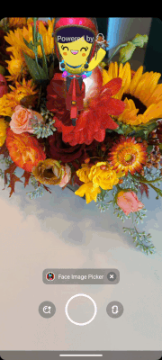

# Camera Kit Sample Custom Lenses Carousel and Camera Preview

This example app shows how to create a custom carousel for your lenses and use a custom layout to
display a camera preview with lenses applied using Camera Kit.

## Build

Open project's `gradle.properties` file and enter values for `com.snap.camerakit.application.id`
, `com.snap.camerakit.api.token` from [Snap Kit Developer Portal](https://snapkit.com/manage)
and `com.snap.camerakit.lenses.group.id` from
your [Camera Kit Portal](https://camera-kit.snapchat.com/). After that to build, install and launch
the `camerakit-sample-custom-carousel` on a connected device follow one of the following options:

### Command Line

- `./gradlew camerakit-sample-custom-carousel:installDebug`

- `adb shell am start -n com.snap.camerakit.sample.carousel/com.snap.camerakit.sample.carousel.MainActivity`

### IDE

Select the `camerakit-sample-custom-carousel` module configuration and click run:

## Steps to create custom layout and lenses carousel

1) Create a `ViewStub` that you will be passing to Camera Kit `Session` object. In this sample app
   this is done in `activity_main.xml` file with a `View` with `camera_kit_stub` ID. This `View`
   will be used to inflate a view hierarchy from the Camera Kit `Session` which includes rendering
   camera preview with a lens applied.
2) Attach the `ViewStub` to Camera Kit `Session` using its builder's `attachTo` method. This is done
   in `MainActivity.kt` file in this example.
3) In this sample we are using the Camera Kit's `CameraXImageProcessorSource` support class for the
   image processing input at the time of `Session` creation in `MainActivity.kt` file. However, you
   are free to use your own image processing input and connect it to `Session.processor` .
4) We are using `RecyclerView` with `GridLayoutManager` for the lenses carousel. Once you have the
   view hierarchy setup you can simply query the lenses repository from the `Session.lenses` object
   to fetch lenses group and fill the `RecyclerView` with the group's items using custom layout as a
   carousel.
5) Fetching from the lenses repository is done in the `MainActivity.kt` file using
   the `cameraKitSession.lenses.repository.observe` method - the retrieved list of lenses are then
   passed on to `LensesAdapter.kt` file as a list of `LensesComponent.Lens` objects.

## Interaction examples

1) Open the lenses carousel by clicking on the lens explorer button to the left of the capture
   button:

   

2) Click on the lens icon to apply that particular lens with auto-flip camera (front or rear facing)
   as per the lens' camera facing preference set in the Lens Studio project.

3) Swipe down to go full screen and hide the lenses carousel:

   

4) Flip the camera button to toggle between the front or the rear facing camera.

5) Highlight the selected lens item in lenses carousel.

   

6) Capture a photo or a video to preview it, and share it with other apps using the Android's share
   sheet:

   

7) Click on the cancel button to clear any applied lens and present the camera with no lens applied:

   

8) Tap on the preview screen while the lenses carousel is open to make it go full screen:

   

