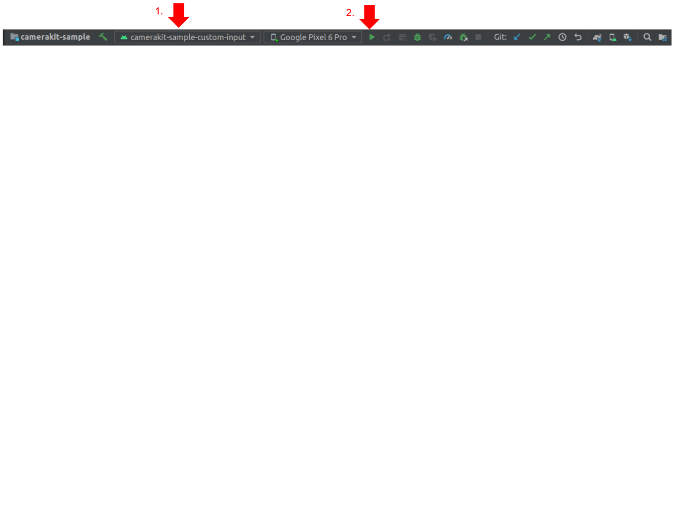

# CameraKit Sample Custom Input App

An app that demonstrates how to setup a custom input to the CameraKit's processing pipeline:

## Build

To build, install and launch the `camerakit-sample-custom-input` on a connected device:

### Command Line

- `./gradlew camerakit-sample-custom-input:installDebug`

- `adb shell am start -n com.snap.camerakit.sample.input/com.snap.camerakit.sample.MainActivity`

### IDE

Select the `camerakit-sample-custom-input` module configuration and click run:

