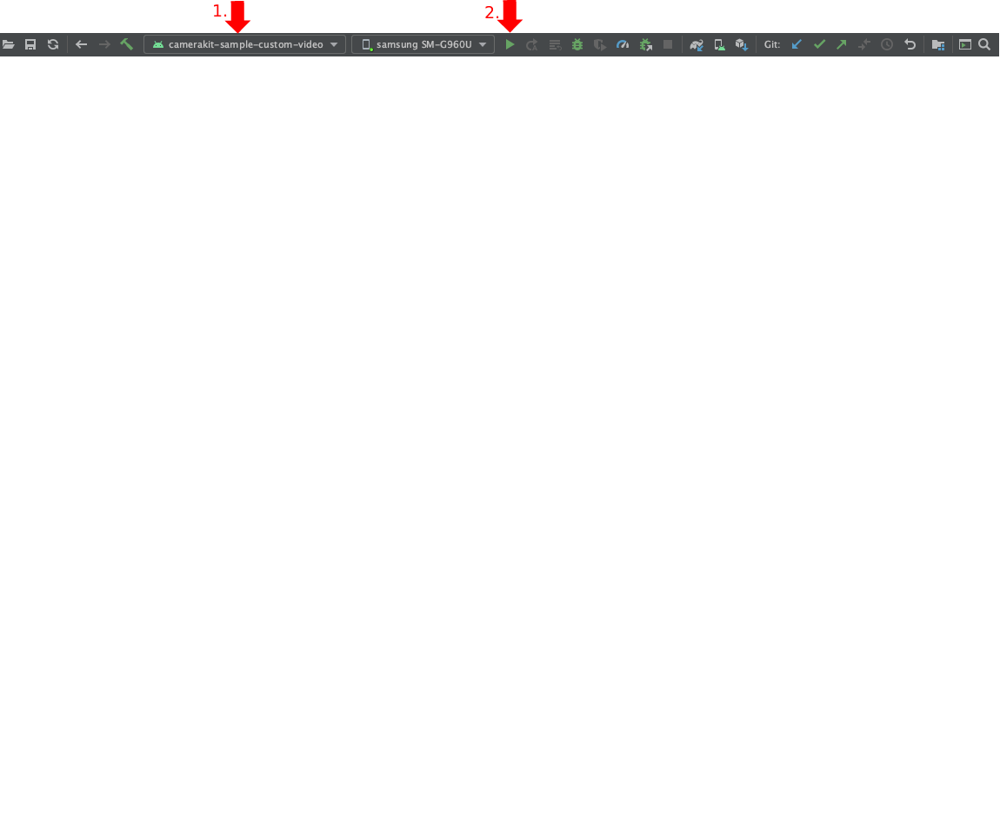

# CameraKit Sample Custom Video App

An app that opens into a camera screen where user can capture videos with lenses applied with native Android video recording architecture:

## Build

To build, install and launch the `camerakit-sample-custom-video` on a connected device:

### Command Line

- `./gradlew camerakit-sample-custom-video:installDebug`

- `adb shell am start -n com.snap.camerakit.sample.video/com.snap.camerakit.sample.MainActivity`

### IDE

Select the `camerakit-sample-custom-video` module configuration and click run:

