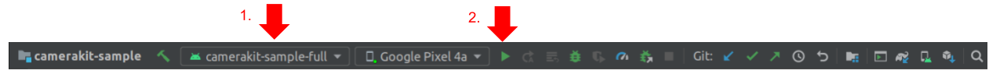

# Camera Kit Sample Full App

An app that opens into a camera screen where user can capture photos or videos with lenses applied:

## Build

To build, install and launch the `camerakit-sample-full` on a connected device:

### Command Line

- `./gradlew camerakit-sample-full:installDebug`

- `adb shell am start -n com.snap.camerakit.sample.full/com.snap.camerakit.sample.MainActivity`

### IDE

Select the `camerakit-sample-full` module configuration and click run:

