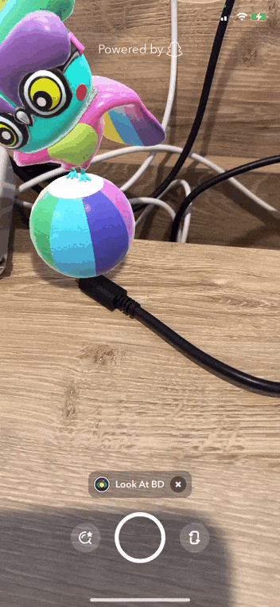

# Camera Kit Alternate Lenses Carousel Sample App

This sample app shows how to create an alternate carousel to select lenses and display a camera view with lenses applied using Camera Kit.

## Setup

See [README.md](./../README.md) for overall project setup.

## Interaction examples

1) Alternate carousel opening and closing:

    

2) Clearing applied lenses:

    

